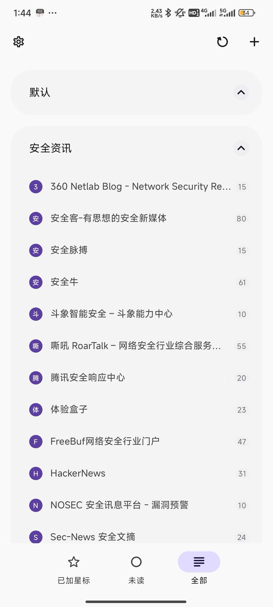
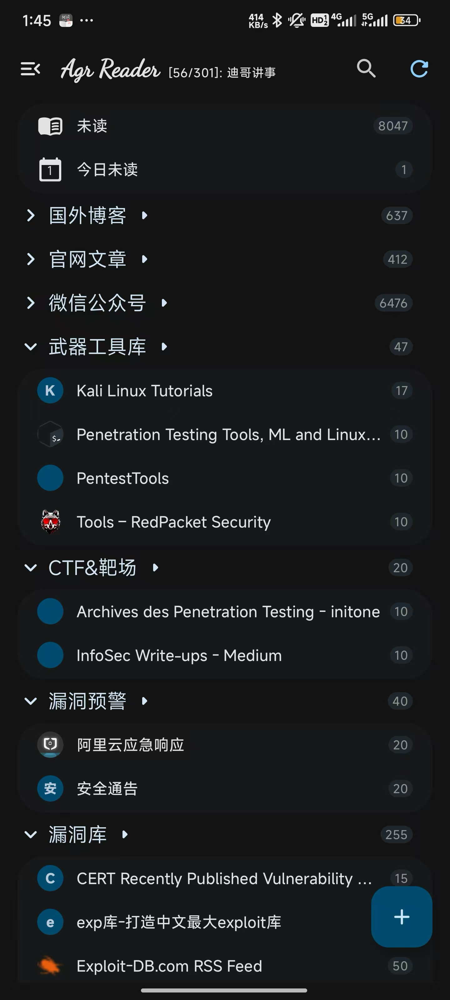
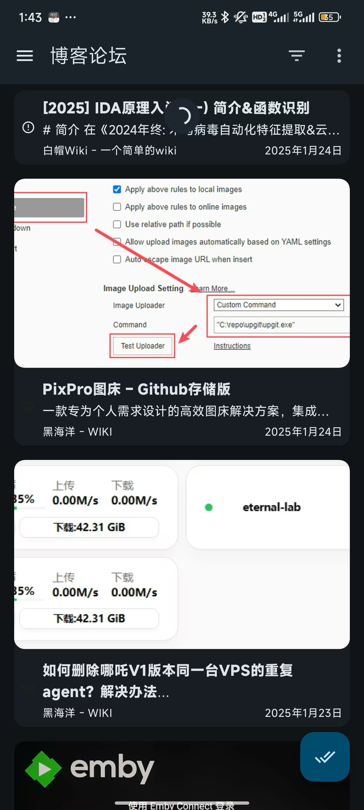

<h1 align="center">SecurityRSS - 安全资讯订阅源 </h1>

  
  
  
  
  

  <a href="http://www.seclions.top/">作者博客</a> | 
  <a href="http://www.seclions.top/document">文档教程</a> | 
  <a href="http://nav.seclions.top/">安全导航</a> | 
  <a href="http://nav.seclions.top/wechat.html">微信公众号导航</a> 

  

### 0x00 前言

#### RSS 是什么

RSS 的全称是「简易内容聚合」（Really Simple Syndication），是一个能让你在一个地方订阅各种感兴趣网站的工具。RSS 阅读器的核心功能，是存储用户订阅的 RSS 地址，以固定的频率自动检查更新，并将其内容转换为易读的格式呈现给用户。

简单地说，当我关注的某个人在知乎或者在博客上写了一篇新文章，我马上就能收到推送。当我关注的人变多了，我不必一一点开知乎、简书、甚至翻看博客去主动获取更新，而是在一个统一的终端内阅读。

#### 为什么用 RSS

RSS 的对立面是算法推荐，如微信公众号、知乎、微博、今日头条等平台。 
1. 算法推送平台广告多，迁移麻烦
2. 算法会根据你的喜好，给你推送内容
3. 在不断被算法「喂饱」中逐渐失去判断的能力
4. **它替你定义了你的画像，然后把你潜移默化中变成了它所认为的你**
5. 「大数据杀熟」，用算法窥视用户隐私是当今互联网公司的通配。

**做信息的主人，而不是奴隶** 
RSS 是一种公开的协议，可自由更换平台与客户端。重要的一点是，**获取信息的权力完全自治**。RSS 相比算法推荐，拥有了可控性和安全感，隐私完全掌握在自己手里。

### 0x01 订阅目录

* [安全资讯](#安全资讯)
* [博客论坛](#博客论坛)
* [官网文章](#官网文章)       
* [国外博客](#国外博客)
* [漏洞库](#漏洞库)
* [漏洞预警](#漏洞预警)
* [实验室团队](#实验室团队)
* [武器工具库](#武器工具库)
* [CTF&靶场](#CTF&靶场)
* [微信公众号](#微信公众号)

### 0x02 版本说明

最新版本v1.2，删除部分长时间未更新的博客和微信公众号

- [SecurityRSS.opml](./SecurityRSS.opml) : 完整版，包含全部分类，订阅数量378个，订阅链接较多，有些RSS阅读器有数量限制。
- [SecurityRSS-Lite.opml](./SecurityRSS-Lite.opml) : 精简版，不包含微信公众号，订阅数量140个，适合快速浏览信息使用。
- [SecurityRSS-Wechat.opml](./SecurityRSS-Wechat.opml) ：微信公众号扩展包，订阅数量238个，可单独导入，也可再次精简使用。

### 0x03 使用手册

#### 1. RSS阅读器推荐

| 名称            | 下载链接                                                     | 推荐理由                                                |
| --------------- | ------------------------------------------------------------ | ------------------------------------------------------- |
| MacOS           | [Reeder](https://reederapp.com/)                             | iOS和macOS系统上最优秀的 RSS 阅读器客户端之一，有PJ版本 |
| Windows         | [Fluent reader](https://github.com/yang991178/fluent-reader) | 开源、跨平台、UI排版美观，现代桌面 RSS 阅读器           |
| Android         | [Feeder](https://github.com/spacecowboy/Feeder)、[Read You](https://github.com/Ashinch/ReadYou)、[AgrReader](https://github.com/Agr-Reader/Agr-Reader) | 三款都是极简优美的RSS阅读器，各取所爱                   |
| Subscribing RSS | [RSSHub](https://github.com/DIYgod/RSSHub)                   | **万物皆可 RSS** 订阅神器                               |
| Self-Host       | [FreshRSS](https://github.com/FreshRSS/FreshRSS)             | 自建订阅服务，支持 Fluent Reader 和 Reeder 的连接       |

#### 2. 使用方法

1. 根据不同需求，下载[SecurityRSS.opml](./SecurityRSS.opml) 、[SecurityRSS-Lite.opml](./SecurityRSS-Lite.opml) 、[SecurityRSS-Wechat.opml](./SecurityRSS-Wechat.opml) 文件;
2. 在客户端导入订阅文件，一般按钮为` Import from OPML`;
3. 等待导入完成，部分订阅导入失败，需要魔法上网，重新导入即可；

4. 下列为Android端导入后的效果，仅供参考；

| Read-You                        | AgrReader                         | Feeder                      |
| ------------------------------- | --------------------------------- | --------------------------- |
|  |  |  |

5. 下图为Windows下Fluent Reader预览效果。

### 0x04 订阅列表

#### 安全资讯

| 标题                                                    | 订阅链接                                           | 状态   |
| ------------------------------------------------------- | -------------------------------------------------- | ------ |
| 360 Netlab Blog -  Network Security Research Lab at 360 | https://blog.netlab.360.com/rss                    | online |
| 安全客-有思想的安全新媒体                               | https://api.anquanke.com/data/v1/rss               | online |
| 安全脉搏                                                | https://www.secpulse.com/feed                      | online |
| 安全牛                                                  | https://www.aqniu.com/feed                         | online |
| 斗象智能安全 – 斗象能力中心                             | https://blog.riskivy.com/feed                      | online |
| 奇客Solidot–传递最新科技情报                            | https://www.solidot.org/index.rss                  | online |
| 嘶吼 RoarTalk – 网络安全行业综合服务平台,4hou.com       | https://www.4hou.com/feed                          | online |
| 腾讯安全响应中心                                        | https://security.tencent.com/index.php/feed/blog/0 | online |
| 体验盒子                                                | https://www.uedbox.com/feed                        | online |
| 先知安全技术社区                                        | https://xz.aliyun.com/feed                         | online |
| FreeBuf网络安全行业门户                                 | https://www.freebuf.com/feed                       | online |
| HackerNews                                              | http://hackernews.cc/feed                          | online |
| NOSEC 安全讯息平台 - 漏洞预警                           | https://rsshub.app/nosec/hole                      | online |
| Sec-News 安全文摘                                       | https://govuln.com/news/feed/                      | online |
| SecWiki News                                            | https://www.sec-wiki.com/news/rss                  | online |
| unSafe.sh - 不安全                                      | https://buaq.net/rss.xml                           | online |

#### 博客论坛

| 标题                                | 订阅链接                                                   | 状态   |
| ----------------------------------- | ---------------------------------------------------------- | ------ |
| 0xfd's blog                         | https://fdlucifer.github.io/atom.xml                       | online |
| 90Sec - 最新话题                    | https://forum.90sec.com/latest.rss                         | online |
| 2019's blog                         | https://mem2019.github.io/feed.xml                         | online |
| 安全小飞侠的窝                      | http://avfisher.win/feed                                   | online |
| 傲慢的上校的专栏                    | http://blog.csdn.net/aomandeshangxiao/rss/list             | online |
| 白帽酱の博客                        | https://rce.moe/atom.xml                                   | online |
| 白帽Wiki - 一个简单的wiki           | https://key08.com/index.php/feed                           | online |
| 半块西瓜皮                          | https://guage.cool/atom.xml                                | online |
| 博客园 - 飘渺红尘✨                  | http://feed.cnblogs.com/blog/u/326112/rss                  | online |
| 博客园 - 渗透测试中心               | https://www.cnblogs.com/backlion/rss                       | online |
| 博客园 - 我是小三                   | https://www.cnblogs.com/2014asm/rss                        | online |
| 博客园 - 郑瀚Andrew                 | https://www.cnblogs.com/LittleHann/rss                     | online |
| 博客园 - admin-神风                 | http://feed.cnblogs.com/blog/u/340041/rss                  | online |
| 博客园 - EtherDream                 | https://feed.cnblogs.com/blog/u/83633/rss                  | online |
| 博客园 - hac425                     | https://www.cnblogs.com/hac425/rss                         | online |
| 博客园 - luoyesiqiu                 | http://feed.cnblogs.com/blog/u/449248/rss                  | online |
| 博客园 - magic_zero                 | http://feed.cnblogs.com/blog/u/266362/rss                  | online |
| 博客园 - nice_0e3                   | https://feed.cnblogs.com/blog/u/592290/rss                 | online |
| 博客园 - PaperPen                   | http://feed.cnblogs.com/blog/u/486049/rss                  | online |
| 博客园 - r00tgrok                   | https://feed.cnblogs.com/blog/u/153647/rss                 | online |
| 博客园 - sevck                      | http://feed.cnblogs.com/blog/u/227407/rss                  | online |
| 博客园 - zha0gongz1                 | http://feed.cnblogs.com/blog/u/569318/rss                  | online |
| 博客园 - Zhengjim                   | https://www.cnblogs.com/zhengjim/rss                       | online |
| 不忘初心 方得始终                   | https://terenceli.github.io/atom.xml                       | online |
| 程序人生                            | https://programlife.net/atom.xml                           | online |
| 打代码的怪兽 CodeMonster            | https://www.codemonster.cn/atom.xml                        | online |
| 风之栖息地                          | http://hurricane618.me/atom.xml                            | online |
| 浮萍's Blog                         | https://fuping.site/atom.xml                               | online |
| 国光                                | https://www.sqlsec.com/atom.xml                            | online |
| 黑海洋 - WIKI                       | https://blog.upx8.com/feed                                 | online |
| 酷 壳 – CoolShell                   | http://coolshell.cn/feed                                   | online |
| 岚光                                | https://0x0d.im/feed                                       | online |
| 离别歌                              | https://www.leavesongs.com/feed/                           | online |
| 李劼杰的博客                        | http://www.lijiejie.com/feed                               | online |
| 明天的乌云                          | https://blog.xlab.app/atom.xml                             | online |
| 素十八                              | https://su18.org/atom.xml                                  | online |
| 天下大木头                          | http://wjlshare.com/feed                                   | online |
| 跳跳糖 - 安全与分享社区             | https://tttang.com/rss.xml                                 | online |
| 薇拉航线                            | https://www.zuozuovera.com/index.xml                       | online |
| 梧桐雨blog                          | http://wutongyu.info/feed                                  | online |
| 信息安全知识库                      | https://vipread.com/feed                                   | online |
| 杨龙                                | https://www.yanglong.pro/feed                              | online |
| 专注APT攻击与防御                   | https://micropoor.blogspot.com/feeds/posts/default?alt=rss | online |
| AabyssZG's Blog                     | https://blog.zgsec.cn/index.php/feed                       | online |
| AresX's Blog                        | https://ares-x.com/atom.xml                                | online |
| ArthurChiao's Blog                  | http://arthurchiao.art/feed.xml                            | online |
| CFC4N的博客                         | https://www.cnxct.com/feed                                 | online |
| Chen's Blog                         | https://gh0st.cn/feed.xml                                  | online |
| Coco413's Blog                      | https://www.coco413.com/feed                               | online |
| darkless                            | https://darkless.cn/atom.xml                               | online |
| giantbranch's blog                  | https://www.giantbranch.cn/atom.xml                        | online |
| glzjin                              | https://www.zhaoj.in/feed                                  | online |
| Gorgias'Blog                        | https://gorgias.me/atom.xml                                | online |
| Green_m's blog                      | https://green-m.me/feed.xml                                | online |
| Hack Inn                            | http://www.hackinn.com/index.php/feed                      | online |
| Hc1m1                               | https://nobb.site/rss.xml                                  | online |
| Huli's blog                         | https://blog.huli.tw/atom-ch.xml                           | online |
| IceSword Lab                        | https://www.iceswordlab.com/atom.xml                       | online |
| Jayl1n's Blog                       | https://jayl1n.github.io/atom.xml                          | online |
| K4YT3X                              | https://k4yt3x.com/index.xml                               | online |
| K8哥哥’s Blog                       | https://k8gege.org/atom.xml                                | online |
| Les1ie                              | https://les1ie.com/feed.xml                                | online |
| LoRexxar's Blog                     | https://lorexxar.cn/atom.xml                               | online |
| M1kael‘s Blog                       | http://blog.m1kael.cn/index.php/feed                       | online |
| MiaoTony's小窝                      | https://miaotony.xyz/atom.xml                              | online |
| Misaki's Blog                       | https://misakikata.github.io/atom.xml                      | online |
| Neurohazard                         | http://wp.blkstone.me/feed                                 | online |
| Nuclear'Atk（核攻击）网络安全实验室 | https://lcx.cc/index.xml                                   | online |
| nul.pw                              | http://www.nul.pw/feed                                     | online |
| o0xmuhe's blog                      | https://o0xmuhe.github.io/atom.xml                         | online |
| Pa55w0rd 's Blog                    | https://www.pa55w0rd.online/atom.xml                       | online |
| Panda的歌曲                         | http://blog.cnpanda.net/feed/atom                          | online |
| paper - Last paper                  | http://paper.seebug.org/rss/                               | online |
| Posts on 青鸟的博客                 | https://blue-bird1.github.io/posts/index.xml               | online |
| print(&quot;&quot;)                 | https://www.o2oxy.cn/feed                                  | online |
| QRZ 的果壳宇宙 ✨                    | https://blog.qrzbing.cn/index.xml                          | online |
| Sakuraのblog                        | http://eternalsakura13.com/atom.xml                        | online |
| Se7en's Blog                        | https://www.se7ensec.cn/atom.xml                           | online |
| Swing'Blog 浮生若梦                 | https://bestwing.me/atom.xml                               | online |
| Toooold                             | https://toooold.com/feed.xml                               | online |
| Tr0y's Blog                         | https://www.tr0y.wang/atom.xml                             | online |
| Tr3jer_CongRong.                    | https://www.thinkings.org/feed.xml                         | online |
| TRY博客                             | https://www.nctry.com/feed                                 | online |
| WHEREISK0SHL                        | http://whereisk0shl.top/feed                               | online |
| X1r0z Blog                          | https://exp10it.cn/index.xml                               | online |
| xmsec - 陌小生                      | https://www.xmsec.cc/rss                                   | online |
| Yang Hao's blog                     | https://yanghaoi.github.io/atom.xml                        | online |
| Yaseng                              | https://yaseng.org/rss.xml                                 | online |
| Zgao's blog                         | https://zgao.top/feed                                      | online |

#### 官网文章

| 标题                                   | 订阅链接                                                     | 状态   |
| -------------------------------------- | ------------------------------------------------------------ | ------ |
| Blackploit [PenTest]                   | http://www.blackploit.com/feeds/posts/default                | online |
| Cybersecurity News                     | https://securityonline.info/feed/                            | online |
| Google Online Security Blog            | http://feeds.feedburner.com/GoogleOnlineSecurityBlog?format=xml | online |
| Invicti                                | https://www.invicti.com/blog/feed/                           | online |
| Kali Linux                             | https://www.kali.org/rss.xml                                 | online |
| Krebs on Security                      | http://krebsonsecurity.com/feed/                             | online |
| Metasploit - Rapid7 Cybersecurity Blog | https://blog.rapid7.com/tag/metasploit/rss/                  | online |
| OFFICIAL HACKER                        | https://www.officialhacker.com/feed/                         | online |
| OffSec                                 | http://www.offensive-security.com/feed/                      | online |
| Pentest Blog                           | https://pentest.blog/feed/                                   | online |
| Pentest Geek                           | https://www.pentestgeek.com/feed                             | online |
| Pentesting                             | https://www.reddit.com/r/Pentesting/.rss                     | online |
| Red Team Security                      | https://www.reddit.com/r/redteamsec/.rss                     | online |
| SecurityWeek RSS Feed                  | http://feeds.feedburner.com/Securityweek                     | online |
| The Exploit Database - CXSecurity.com  | https://cxsecurity.com/wlb/rss/exploit/                      | online |
| infosecurity                           | http://www.infosecurity-magazine.com/rss/news/               | online |
| VulnHub ~ Entries                      | https://www.vulnhub.com/feeds/added/atom/                    | online |

#### 国外博客

| 标题                                                         | 订阅链接                                                     | 状态   |
| ------------------------------------------------------------ | ------------------------------------------------------------ | ------ |
| 0x00sec - The Home  of the Hacker - Latest posts             | https://0x00sec.org/posts.rss                                | online |
| 128 nops and counting                                        | https://carstein.github.io/feed.xml                          | online |
| Alexander V. Leonov                                          | https://avleonov.com/feed/                                   | online |
| Appsecco - Medium                                            | https://blog.appsecco.com/feed                               | online |
| Artificial Intelligence – Penetration  Testing Tools, ML and Linux Tutorials | https://reconshell.com/category/data-science/artificial-intelligence/feed/ | online |
| Attify Blog - IoT Security, Pentesting  and Exploitation     | https://blog.attify.com/rss/                                 | online |
| Bad Sector Labs Blog                                         | https://blog.badsectorlabs.com/feeds/all.atom.xml            | online |
| Blog                                                         | https://sevenlayers.com/index.php/blog?format=feed&amp;type=rss | online |
| bunnie's blog                                                | https://www.bunniestudios.com/blog/?feed=rss2                | online |
| Cyber Gladius                                                | https://cybergladius.com/feed/                               | online |
| Cyber Kendra                                                 | https://www.cyberkendra.com/feeds/posts/default              | online |
| Ethical hacking and penetration testing                      | https://miloserdov.org/?feed=rss2                            | online |
| Fidelis Security                                             | https://fidelissecurity.com/feed/                            | online |
| Hacking Tutorials                                            | https://www.hackingtutorials.org/feed/                       | online |
| HackMag                                                      | https://hackmag.com/feed/                                    | online |
| NVISO Labs                                                   | https://blog.nviso.eu/feed/                                  | online |
| Pen Test Partners                                            | https://www.pentestpartners.com/feed/                        | online |
| Pentester Academy Blog - Medium                              | https://blog.pentesteracademy.com/feed                       | online |
| Podalirius                                                   | https://podalirius.net/en/index.xml                          | online |
| Posts on BananaMafia                                         | https://bananamafia.dev/post/index.xml                       | online |
| PwnDefend                                                    | https://www.pwndefend.com/feed/                              | online |
| Rasta Mouse                                                  | https://rastamouse.me/feed/                                  | online |
| RedPacket Security                                           | https://www.redpacketsecurity.com/feed/                      | online |
| S3cur3Th1sSh1t                                               | https://s3cur3th1ssh1t.github.io/feed.xml                    | online |
| Stories by Kevin Beaumont on Medium                          | https://medium.com/feed/@networksecurity                     | online |
| Techorganic                                                  | https://blog.techorganic.com/atom.xml                        | online |
| Threatninja.net                                              | https://threatninja.net/feed/                                | online |
| zSecurity                                                    | https://zsecurity.org/feed/                                  | online |

#### 漏洞库

| 标题                                         | 订阅链接                                               | 状态   |
| -------------------------------------------- | ------------------------------------------------------ | ------ |
| CERT Recently  Published Vulnerability Notes | http://www.kb.cert.org/vulfeed                         | online |
| exp库-打造中文最大exploit库                  | http://www.expku.com/rss/rss.xml                       | online |
| Exploit-DB.com RSS Feed                      | http://www.exploit-db.com/rss.xml                      | online |
| phpMyAdmin security announcements            | http://www.phpmyadmin.net/home_page/security/index.xml | online |
| Sploitus.com Exploits RSS Feed               | https://sploitus.com/rss                               | online |
| VulDB Recent Entries                         | https://vuldb.com/?rss.recent                          | online |
| VulDB Recent Entries                         | https://vuldb.com/en/?rss.recent                       | online |
| Vulners.com RSS Feed                         | https://vulners.com/rss.xml                            | online |
| Vulners.com RSS Feed                         | https://vulners.com/rss.xml?query=type:hackerone       | online |

#### 漏洞预警

| 标题            | 订阅链接                                                     | 状态   |
| --------------- | ------------------------------------------------------------ | ------ |
| 阿里云应急响应  | https://wechat2rss.xlab.app/feed/311c02e5c56e5c0bcdf41924909407ed2d569d2a.xml | online |
| 安全通告        | https://www.huawei.com/cn/rss-feeds/psirt/rss                | online |
| Seebug 最新漏洞 | https://www.seebug.org/rss/new                               | online |

#### 实验室团队

| 标题                   | 订阅链接                                                     | 状态   |
| ---------------------- | ------------------------------------------------------------ | ------ |
| 滴滴安全应急响应中心   | https://wechat2rss.xlab.app/feed/97cd46da8232bd740c02838e1c579182f9636e3e.xml | online |
| 绿盟科技技术博客       | http://blog.nsfocus.net/feed                                 | online |
| 绿盟科技CERT           | https://wechat2rss.xlab.app/feed/aa2ff3b0167a3f449f3b116717b5350ab64df8c3.xml | online |
| 美团技术团队           | https://tech.meituan.com/feed                                | online |
| 奇安信 CERT            | https://wechat2rss.xlab.app/feed/981c000a01bbdc1f128d260cc91c15d3a6afb530.xml | online |
| 腾讯安全玄武实验室     | https://xlab.tencent.com/cn/atom.xml                         | online |
| 腾讯科恩实验室官方博客 | https://keenlab.tencent.com/zh/atom.xml                      | online |

#### 武器工具库

| 标题                                               | 订阅链接                                               | 状态   |
| -------------------------------------------------- | ------------------------------------------------------ | ------ |
| Kali Linux  Tutorials                              | https://kalilinuxtutorials.com/feed/                   | online |
| KitPloit - PenTest Tools!                          | http://feeds.feedburner.com/PentestTools               | online |
| Penetration Testing Tools, ML and Linux  Tutorials | https://reconshell.com/feed/                           | online |
| PentestTools                                       | https://pentesttools.net/feed/                         | online |
| Tools – RedPacket Security                         | https://www.redpacketsecurity.com/category/tools/feed/ | online |

#### CTF&靶场

| 标题                                        | 订阅链接                                              | 状态   |
| ------------------------------------------- | ----------------------------------------------------- | ------ |
| Archives des  Penetration Testing - initone | https://initone.dz/category/penetration-testing/feed/ | online |
| Hacking Articles                            | https://www.hackingarticles.in/feed/                  | online |
| InfoSec Write-ups - Medium                  | https://infosecwriteups.com/feed                      | online |

### 微信公众号

| 标题                         | 订阅链接                                                     | 状态   |
| ---------------------------- | ------------------------------------------------------------ | ------ |
| 0x727开源安全团队            | https://wechat2rss.xlab.app/feed/fb95636ab2edd220c83bc38b7041bb8e0a723496.xml | online |
| 7bits安全团队                | https://wechat2rss.xlab.app/feed/d8600777ce9d3efc16ac3cc3885aba6f107bc10b.xml | online |
| 41group                      | https://wechat2rss.xlab.app/feed/d840d8b21d5635eb5b332a61f472de54579c8a30.xml | online |
| 58安全应急响应中心           | https://wechat2rss.xlab.app/feed/f4ff9e0e30f68dd38a44232522bdb980791a7587.xml | online |
| 360漏洞云                    | https://wechat2rss.xlab.app/feed/ca1fddd8505a3473feed12c0bee898e97d4d5eae.xml | online |
| 360数字安全                  | https://wechat2rss.xlab.app/feed/85e7bf4fe192ded1a15f130aa43ac306d227f61b.xml | online |
| 360威胁情报中心              | https://wechat2rss.xlab.app/feed/920f171e3dae0c8eeb4c97b366b229ba19807732.xml | online |
| 360Quake空间测绘             | https://wechat2rss.xlab.app/feed/fd912d34201eea9dbaaa73e22bffee21636c0f9e.xml | online |
| 404 Not F0und                | https://wechat2rss.xlab.app/feed/56ccecd04a64c0459442d07f30325218f8b4f210.xml | online |
| 阿里安全响应中心             | https://wechat2rss.xlab.app/feed/544a8a6edc551b8a2975fbb76b7de1637570d0e7.xml | online |
| 安恒威胁情报中心             | https://wechat2rss.xlab.app/feed/de09ec267e5c4545e0a759cc62c3da7866ea49e0.xml | online |
| 安全419                      | https://wechat2rss.xlab.app/feed/6f33507162907318fd059fb11977ca352ff55d8e.xml | online |
| 安全产品人的赛博空间         | https://wechat2rss.xlab.app/feed/923ebe72c2b551e158bcce2f9e6262dd563b3b75.xml | online |
| 安全村SecUN                  | https://wechat2rss.xlab.app/feed/13267b55f2dbff6e536b4d593408fe0ef977cb43.xml | online |
| 安全防御                     | https://wechat2rss.xlab.app/feed/aa17887af0644ece8360baf00c4c3d0642a745df.xml | online |
| 安全分析与研究               | https://wechat2rss.xlab.app/feed/62ba31603ffe26b5a8eca9ddaa434ea612445c10.xml | online |
| 安全攻防团队                 | https://wechat2rss.xlab.app/feed/85da1127d3027be44cf4f3a7b3198c622f8fbe1b.xml | online |
| 安全界                       | https://wechat2rss.xlab.app/feed/aed7268b7dd5468e8efca43e19948186d7205886.xml | online |
| 安全客                       | https://wechat2rss.xlab.app/feed/7fc9f5344f14228ba49208282d844349f8afdee7.xml | online |
| 安全乐观主义                 | https://wechat2rss.xlab.app/feed/99e8a156f4f0a3b45bb206945e55cb193672da81.xml | online |
| 安全内参                     | https://wechat2rss.xlab.app/feed/d5eb8577bf93aacdd7481ad0c3364939096b99a1.xml | online |
| 安全牛                       | https://wechat2rss.xlab.app/feed/10f1ba549b70cdb4216f7ade606d30a813305aa1.xml | online |
| 安全喷子                     | https://wechat2rss.xlab.app/feed/158efac9a94e62404af4bc804a6d6dcd55caa44f.xml | online |
| 安全圈                       | https://wechat2rss.xlab.app/feed/d568d6fca93d750898111f09cc3c551e7a62f7ab.xml | online |
| 安全实践                     | https://wechat2rss.xlab.app/feed/2d77edf78f6cc321308b81ac9f5d117e2f3fb7d1.xml | online |
| 安全树洞                     | https://wechat2rss.xlab.app/feed/08f314092c056259db01e6c7075d246ac76dc713.xml | online |
| 安全小飞侠                   | https://wechat2rss.xlab.app/feed/869b4e387a017fdd76a56b965ee0ab22c2a52dc2.xml | online |
| 安全小黄鸭                   | https://wechat2rss.xlab.app/feed/15824aba690f6db2a4922191b262ed22a3b8bec1.xml | online |
| 安全行者老霍                 | https://wechat2rss.xlab.app/feed/82cb8f76f8e4d0ca29f497944330ef57aa1f22db.xml | online |
| 安全学术圈                   | https://wechat2rss.xlab.app/feed/8c5d5f0004e7231abeb01dac49cac5da4ec6933d.xml | online |
| 安全研究GoSSIP               | https://wechat2rss.xlab.app/feed/ac4004481c5b78892663e13bb3af8422d4ebeb68.xml | online |
| 安全引擎                     | https://wechat2rss.xlab.app/feed/002fe975bae4232ce63c51ef77519d0f1cb646c8.xml | online |
| 安天AVL威胁情报中心          | https://wechat2rss.xlab.app/feed/c17498223ad8f92e5434100b16f4894a3107a90b.xml | online |
| 暗影安全                     | https://wechat2rss.xlab.app/feed/44dc3cfe1a58cd4c818178052cbca34c5f9b336d.xml | online |
| 白帽100安全攻防实验室        | https://wechat2rss.xlab.app/feed/55990eaae05ad1430e2ba4955756b215a99896c9.xml | online |
| 白日放歌须纵9                | https://wechat2rss.xlab.app/feed/fbb786b3c5d138ed27a7ca2f9734cfc90e9b9417.xml | online |
| 白泽安全实验室               | https://wechat2rss.xlab.app/feed/6bdf0d750e8c418f6ddfe8826c7a29f786a74aa4.xml | online |
| 百度安全实验室               | https://wechat2rss.xlab.app/feed/c396e3a4fb11318adaa9dac2637657d6fe56ba90.xml | online |
| 百度安全应急响应中心         | https://wechat2rss.xlab.app/feed/2b0b4d99312e57d27a294d18de8dfb8f9c272fd4.xml | online |
| 毕方安全实验室               | https://wechat2rss.xlab.app/feed/e30371f4b2e600a87cb0718d649d6c43411622b3.xml | online |
| 表图                         | https://wechat2rss.xlab.app/feed/657873c2f534ea1c50875c8657bc405270ce7cd0.xml | online |
| 拨开云雾                     | https://wechat2rss.xlab.app/feed/b522811243a36e50628af702a4235b29ff0bdd5e.xml | online |
| 补天平台                     | https://wechat2rss.xlab.app/feed/716b21d89522f8bb90b25249ebf00692522d5612.xml | online |
| 不忘初心px1624               | https://wechat2rss.xlab.app/feed/ccbd9e00f08cbd4c34f7f08060cfb5d4179843a5.xml | online |
| 漕河泾小黑屋                 | https://wechat2rss.xlab.app/feed/f38c9a9f230e19f49918faefc5d0d0fc71e52d29.xml | online |
| 承影安全团队ChengYingTeam    | https://wechat2rss.xlab.app/feed/7528d5257a3331281075aa520209d782adf7bb12.xml | online |
| 大兵说安全                   | https://wechat2rss.xlab.app/feed/e5d7d4cd30d4467c6e50410a89bd5262c21eae22.xml | online |
| 代码审计SDL                  | https://wechat2rss.xlab.app/feed/bec4267fed1028fa85c18e1281f7a358d6c8c706.xml | online |
| 代码卫士                     | https://wechat2rss.xlab.app/feed/77cfc87fa0e7200d7ef74c8956eca2e44fd6a4ec.xml | online |
| 道哥的黑板报                 | https://wechat2rss.xlab.app/feed/980128c3a0c9ff852a06dd4a2bc3391338e05760.xml | online |
| 迪哥讲事                     | https://wechat2rss.xlab.app/feed/6fbc842cdb8fd52f341af76f6aaf6cba21a23f7c.xml | online |
| 谛听ditecting                | https://wechat2rss.xlab.app/feed/e91ca0416d5a5dfc93ce14c0598416d4df1a3bf2.xml | online |
| 电子数据取证与鉴定           | https://wechat2rss.xlab.app/feed/aa202e8b44eec0847ad9ab2bece74addfede9894.xml | online |
| 电子物证                     | https://wechat2rss.xlab.app/feed/bb1aa1ced567490c8eec9d764e4909f694aab711.xml | online |
| 丁爸 情报分析师的工具箱      | https://wechat2rss.xlab.app/feed/4fad165589ac854de97e576a6dbcfbd8b9f75320.xml | online |
| 东软NetEye网络安全           | https://wechat2rss.xlab.app/feed/b43d85353a1b4bdd46153e06264f4b63583a78ae.xml | online |
| 洞源实验室                   | https://wechat2rss.xlab.app/feed/ed8dcc9aa1014eb34c7fd7dc0ef6b96272ed99e0.xml | online |
| 斗象智能安全                 | https://wechat2rss.xlab.app/feed/5b72c7dcf37ab8e8c6e5745ecf2701b4ba3cd355.xml | online |
| 二道情报贩子                 | https://wechat2rss.xlab.app/feed/86512202e74d01447788f355c4a4171a3c86740a.xml | online |
| 放之                         | https://wechat2rss.xlab.app/feed/672af7872ddae7ee20df9a3f2560224fb16babc3.xml | online |
| 非尝咸鱼贩                   | https://wechat2rss.xlab.app/feed/255746ce1fb5befc63e2be00eb25795409048fcb.xml | online |
| 分类乐色桶                   | https://wechat2rss.xlab.app/feed/5978638470af63bf67edad170b4e8e9eb945b948.xml | online |
| 复旦白泽战队                 | https://wechat2rss.xlab.app/feed/882ec123376dc8e89d3c5f6ef4bd2fdd0af65465.xml | online |
| 该账号已注销                 | https://wechat2rss.xlab.app/feed/0628f5f1764e0d79813846e7706daef229f464a7.xml | online |
| 干杯Security                 | https://wechat2rss.xlab.app/feed/a8422817da57b5ad2c39c8f264d2eeef683bb338.xml | online |
| 关键基础设施安全应急响应中心 | https://wechat2rss.xlab.app/feed/1aa5b8c8e4fb27ccb905694f7563b5529cd12269.xml | online |
| 关注安全技术                 | https://wechat2rss.xlab.app/feed/2f38aa5ec9e067b1d02196f5a50665f8ec23a4e4.xml | online |
| 国家互联网应急中心CNCERT     | https://wechat2rss.xlab.app/feed/c6662e88d278561b8293a607dcdcbe26aea98e04.xml | online |
| 汉客儿                       | https://wechat2rss.xlab.app/feed/c9f053d41976b087f8df87064a6e1b6223f9cac1.xml | online |
| 汉客儿安全笔记               | https://wechat2rss.xlab.app/feed/71f7fe130360b40edf3b22e222ca2a147912893d.xml | online |
| 航行笔记                     | https://wechat2rss.xlab.app/feed/4a76fbd471f0952829df9c488986bbcc67ff8790.xml | online |
| 黑哥虾撩                     | https://wechat2rss.xlab.app/feed/27be924bf0d49a8d3ff45c0a85e9c6e94ba7a93c.xml | online |
| 黑鸟                         | https://wechat2rss.xlab.app/feed/f22e132bbbc4e8070cd51c0a84802f940e131a20.xml | online |
| 黑奇士                       | https://wechat2rss.xlab.app/feed/47cf1260cf37d1de55b263afbf47e6cb6cae7d29.xml | online |
| 黑伞安全                     | https://wechat2rss.xlab.app/feed/9779044929b45805a5c1b0fecf5f6a95c7202818.xml | online |
| 红队防线                     | https://wechat2rss.xlab.app/feed/5d5dbfc442f65c9345f4d77cb84e2593d2a0c397.xml | online |
| 红日安全                     | https://wechat2rss.xlab.app/feed/3b69d8965599130a19b70d7690b5abdb7d107483.xml | online |
| 虎符智库                     | https://wechat2rss.xlab.app/feed/792558edf818ce03d377d1d2677afb4d6537853d.xml | online |
| 花茶安全攻防Team             | https://wechat2rss.xlab.app/feed/67968324b3147407bc172b38832acd931955e743.xml | online |
| 花指令安全实验室             | https://wechat2rss.xlab.app/feed/1c1f6eeede24a34f08ac362de07be36f79a7e986.xml | online |
| 回忆飘如雪                   | https://wechat2rss.xlab.app/feed/fa41acf1a0d9c54d4caf973349e7bd99d5de61c6.xml | online |
| 火绒安全                     | https://wechat2rss.xlab.app/feed/e6da68c95a8f1e2fb40f6691d0ce9addc51a7532.xml | online |
| 火线安全平台                 | https://wechat2rss.xlab.app/feed/36738a4bf3055c808494d72d9b3372c00f38c8e8.xml | online |
| 火线Zone                     | https://wechat2rss.xlab.app/feed/a64c88f6f65115735413fa0c7e8be27f6acc8292.xml | online |
| 极客公园                     | https://wechat2rss.xlab.app/feed/1a5aec98e71c707c8ca092bc2c255b9d4bac477d.xml | online |
| 记月                         | https://wechat2rss.xlab.app/feed/21f7777ea1da950d1a49edffa59ef75ddbed8684.xml | online |
| 技可达工作室                 | https://wechat2rss.xlab.app/feed/aff52b9db3b57b1fcf24b40668d44baecd3da044.xml | online |
| 技术猫屋                     | https://wechat2rss.xlab.app/feed/c48bba56bd4329af4db5c7b0eacf3d2f1c43c8df.xml | online |
| 技艺丛谈                     | https://wechat2rss.xlab.app/feed/45ef431eb5e61b3ff7802ef329290a4dcc377031.xml | online |
| 甲方安全建设                 | https://wechat2rss.xlab.app/feed/130f6c9e835ca7f7c9f329a93140129499970662.xml | online |
| 锦行科技                     | https://wechat2rss.xlab.app/feed/d04e70055c2d31441deb3188d433a027fc8079cc.xml | online |
| 京东安全应急响应中心         | https://wechat2rss.xlab.app/feed/9bce95ccd16c1e5e30f45722847cc9ea2a27c09d.xml | online |
| 鲸落的杂货铺                 | https://wechat2rss.xlab.app/feed/0dda9f6157d97813067cd3965f772abc35bfdf4c.xml | online |
| 酒仙桥六号部队               | https://wechat2rss.xlab.app/feed/164eeaeb12a8d95384d8807f41d3572569296029.xml | online |
| 君哥的体历                   | https://wechat2rss.xlab.app/feed/947b46dba9754e10360d267a5ee9a87597e0bafe.xml | online |
| 看雪学苑                     | https://wechat2rss.xlab.app/feed/0e026637254d450ae84c59f87d4e4fb4616651ca.xml | online |
| 宽字节安全                   | https://wechat2rss.xlab.app/feed/2b4f112d9e25f5ef0abf85e6b31f7d02602672ab.xml | online |
| 懒人在思考                   | https://wechat2rss.xlab.app/feed/773908acbc527a9a8637862bc6fad7fc8a916090.xml | online |
| 乐枕迭代日志                 | https://wechat2rss.xlab.app/feed/91295bd6da13eb5cd50a544a9d3df76f6f863fac.xml | online |
| 雷神众测                     | https://wechat2rss.xlab.app/feed/3fc5f554af76c0164779add7c5206bdc6f2efe5b.xml | online |
| 冷渗透                       | https://wechat2rss.xlab.app/feed/c23cb9dcbc234e732381ea10aa3d2fe1394ab36d.xml | online |
| 李姐姐的扫描器               | https://wechat2rss.xlab.app/feed/fda4c8b72435cffdc50c9c6e5eb0041a82eac679.xml | online |
| 猎户攻防实验室               | https://wechat2rss.xlab.app/feed/fe0f4b4ed13da1bd9296fe819c5770526ae910b0.xml | online |
| 凌晨一点零三分               | https://wechat2rss.xlab.app/feed/02330475f466041c89e4db3abdf4ce9b1311a6cb.xml | online |
| 零队                         | https://wechat2rss.xlab.app/feed/e54af90b7ef21f732ed6d2d7a58d4aefac9f9faa.xml | online |
| 零鉴科技                     | https://wechat2rss.xlab.app/feed/f7f4ab7bdc8c827727561bd14ed6c26ad0624a6f.xml | online |
| 楼兰学习网络安全             | https://wechat2rss.xlab.app/feed/6f8d8640d6c8d59ba52ea8a8b5df8529a59e872a.xml | online |
| 漏洞推送                     | https://wechat2rss.xlab.app/feed/e5a0a3d839536204e4bcec6ede59fe0cc11f6fc6.xml | online |
| 漏洞战争                     | https://wechat2rss.xlab.app/feed/a884cb33e3393db2f683c48d82012836295ec005.xml | online |
| 绿盟科技研究通讯             | https://wechat2rss.xlab.app/feed/21b46d78e363b85d6927970267ecea4904f06bc8.xml | online |
| 落水轩                       | https://wechat2rss.xlab.app/feed/09d2ae436c3aa6166353d53502096e1a957a808a.xml | online |
| 慢雾科技                     | https://wechat2rss.xlab.app/feed/9e9c3c70e598266a1ac993e50458a10a6d853eb7.xml | online |
| 矛和盾的故事                 | https://wechat2rss.xlab.app/feed/308da52e82d7f7bc2a9f6a5f63633c5567b7af08.xml | online |
| 美丽联合集团安全应急响应中心 | https://wechat2rss.xlab.app/feed/e111066ebfbbba805ee4ab5c745b92b5e567bd90.xml | online |
| 美团安全应急响应中心         | https://wechat2rss.xlab.app/feed/294bc034c9941529cd86a8a4b8999d100186c04d.xml | online |
| 美团技术团队                 | https://wechat2rss.xlab.app/feed/eb4d04149424a874693a51c6fdda0dba8673f5e4.xml | online |
| 梦之光芒的电子梦             | https://wechat2rss.xlab.app/feed/e83f8149ea130c384bb4cb8d690b33bd392ce1b6.xml | online |
| 陌陌安全                     | https://wechat2rss.xlab.app/feed/9ed3866991b2dec386b67cc579ab80f510abccc2.xml | online |
| 墨菲安全                     | https://wechat2rss.xlab.app/feed/e7d4a6f783d2e42b91a70a9f802e590444d62952.xml | online |
| 默安科技                     | https://wechat2rss.xlab.app/feed/0a0fb079fdb28ad7c49e5a6cbd9cf909c9873d86.xml | online |
| 默安玄甲实验室               | https://wechat2rss.xlab.app/feed/181cb187893448582b37198afeadd4c4cf0750a9.xml | online |
| 娜璋AI安全之家               | https://wechat2rss.xlab.app/feed/ac86a71f04b6d10cc5a87ec9ecc8c94fff5d80d1.xml | online |
| 奶牛安全                     | https://wechat2rss.xlab.app/feed/7772ec79ac327394596861ae412fc25a823e09d0.xml | online |
| 鸟哥谈安全                   | https://wechat2rss.xlab.app/feed/564971d18e4771aa4494c8b930dc912b04e6743d.xml | online |
| 纽创信安                     | https://wechat2rss.xlab.app/feed/352d9634e6837532ddae7494aaf146e0aa71235a.xml | online |
| 农夫安全团队                 | https://wechat2rss.xlab.app/feed/ea9b226a78afac0166bb9bdee7de836766441073.xml | online |
| 胖哈勃                       | https://wechat2rss.xlab.app/feed/280cc6aaef116a9701025a97aa73f7ee731bac36.xml | online |
| 胖猴实验室                   | https://wechat2rss.xlab.app/feed/073cf053abc1ab6a318b246e8f21386e85c53d6a.xml | online |
| 皮相                         | https://wechat2rss.xlab.app/feed/41a459a80e37e15d9706465eee48ff491911a36f.xml | online |
| 朴实无华lake2                | https://wechat2rss.xlab.app/feed/d452e14a90682f0ce670dcce1a041f56593260fc.xml | online |
| 七夜安全博客                 | https://wechat2rss.xlab.app/feed/019145f03889dce72141b912d697750e7e00106a.xml | online |
| 奇安盘古                     | https://wechat2rss.xlab.app/feed/88d970d199a87a8a8655e5aa0af7bcea07ac07e6.xml | online |
| 奇安信病毒响应中心           | https://wechat2rss.xlab.app/feed/7874947663d806190d77bdca6f8f6855f65a1b20.xml | online |
| 奇安信威胁情报中心           | https://wechat2rss.xlab.app/feed/b93962f981247c0091dad08df5b7a6864ab888e9.xml | online |
| 钱塘门外的互联网散修         | https://wechat2rss.xlab.app/feed/bf791d6a822e8f48b4f6aa056e42758479362281.xml | online |
| 掮客酒馆                     | https://wechat2rss.xlab.app/feed/10fdc27bdac746197d79a7632053fee231f37bcd.xml | online |
| 青藤云安全                   | https://wechat2rss.xlab.app/feed/f35b2e0c0e9439b0085a851a1514a11c0ad89887.xml | online |
| 青藤智库                     | https://wechat2rss.xlab.app/feed/1063f6d607a637eb0ddc129b58bd081820dd31cb.xml | online |
| 青衣十三楼飞花堂             | https://wechat2rss.xlab.app/feed/373e03599246ef117e24c9ca900acfe168601a81.xml | online |
| 情报分析师                   | https://wechat2rss.xlab.app/feed/f50063f977eea0ce26836189fb7c3034f7e3d4f8.xml | online |
| 情报小蜜蜂                   | https://wechat2rss.xlab.app/feed/78f3da7a79babd1ab1a2831f37718630f41b77b5.xml | online |
| 取证杂谈                     | https://wechat2rss.xlab.app/feed/6ce082e908ac0894ff00b2d9d8e186181cd810bd.xml | online |
| 全频带阻塞干扰               | https://wechat2rss.xlab.app/feed/d2b0dc03acc579a8a9c7aa45bf1f531ed5563f59.xml | online |
| 全闲话                       | https://wechat2rss.xlab.app/feed/a36d83e725f688bd999b039c259940f72d3514b3.xml | online |
| 认知独省                     | https://wechat2rss.xlab.app/feed/83f81eece114fa0cb211ab5379fda72760dc5b68.xml | online |
| 软件安全与逆向分析           | https://wechat2rss.xlab.app/feed/021e3a28dfa435253d1b5610e6678205ea0919b6.xml | online |
| 赛博攻防悟道                 | https://wechat2rss.xlab.app/feed/1bbe066c89588a1aff71eb8b6a4446c7c422499f.xml | online |
| 赛博回忆录                   | https://wechat2rss.xlab.app/feed/b2fd128a6c259f160f380ffe90c17ce05bdc780f.xml | online |
| 赛博昆仑CERT                 | https://wechat2rss.xlab.app/feed/fb14ec6353e6ebbeb470d35d633471d0bca583a0.xml | online |
| 赛博少女                     | https://wechat2rss.xlab.app/feed/f17b52a78a32b532f0d7729e6cf7d94a669c1d53.xml | online |
| 三六零CERT                   | https://wechat2rss.xlab.app/feed/2dbce2e5f7b49dc8415db7a0ab325929e0f5d8c3.xml | online |
| 山石网科安全技术研究院       | https://wechat2rss.xlab.app/feed/dce539f9deadfc68ce8bf82d3be59a4c6d8ddef9.xml | online |
| 深潜之眼                     | https://wechat2rss.xlab.app/feed/2bd44e5502a5ab5b55eb8a732449d8342a6defe9.xml | online |
| 深信服千里目安全技术中心     | https://wechat2rss.xlab.app/feed/027c7f3b98d9d0f2db84513f0cb94f02e9a8a3d7.xml | online |
| 渗透测试网络安全             | https://wechat2rss.xlab.app/feed/4470030205d4d847065a2f0d26219b280b421440.xml | online |
| 数工复利                     | https://wechat2rss.xlab.app/feed/9daa406071d03da194ea8a0b35f1982c288ba366.xml | online |
| 数据安全与取证               | https://wechat2rss.xlab.app/feed/8c9b7e3366ca88442203715d5616c05d24d0306c.xml | online |
| 数世咨询                     | https://wechat2rss.xlab.app/feed/9da87fba8130d0c2dc52cc45b844f045227e06a7.xml | online |
| 思想花火                     | https://wechat2rss.xlab.app/feed/5b925323244e9737c39285596c53e3a2f4a30774.xml | online |
| 嘶吼专业版                   | https://wechat2rss.xlab.app/feed/d351be711510e0b7ccbcb275cdfab5c4c7e3e839.xml | online |
| 俗事吧                       | https://wechat2rss.xlab.app/feed/892464522627f503ae525d1df3c2690bca98b424.xml | online |
| 腾讯安全威胁情报中心         | https://wechat2rss.xlab.app/feed/034265b14906a59ef7cf1fcbd56699b54a696094.xml | online |
| 腾讯安全应急响应中心         | https://wechat2rss.xlab.app/feed/7898375f78fd1018302d54577cd0fd05d5ed324f.xml | online |
| 腾讯安全智能                 | https://wechat2rss.xlab.app/feed/88c9f7cfba0f4f60415eedf32cc5958b131c7065.xml | online |
| 腾讯代码安全检查Xcheck       | https://wechat2rss.xlab.app/feed/267f1258101e978e4cc8507724579217adf600cf.xml | online |
| 腾讯科恩实验室               | https://wechat2rss.xlab.app/feed/13584cb01e8bf3297943a0dad49e53c6faf20611.xml | online |
| 腾讯玄武实验室               | https://wechat2rss.xlab.app/feed/923c0e2f33b6d39c8a826a90f185725f0edb10e8.xml | online |
| 天黑说嘿话                   | https://wechat2rss.xlab.app/feed/d5a661c1beccdff18ba1ae018514e4d702feac74.xml | online |
| 天融信阿尔法实验室           | https://wechat2rss.xlab.app/feed/a9cfdddef757b0ebac0428f629869b69028c43fa.xml | online |
| 天书奇坛TFT                  | https://wechat2rss.xlab.app/feed/53682fed50f2e9f3be9c8f58329e6022ef2fd201.xml | online |
| 天问记事簿                   | https://wechat2rss.xlab.app/feed/a6b4c4531776fa4f4e837ca1fd56e5acd1df8f54.xml | online |
| 天玄安全实验室               | https://wechat2rss.xlab.app/feed/6756212c81a850d9ee50d69cb4036b6a6f70f31b.xml | online |
| 天御攻防实验室               | https://wechat2rss.xlab.app/feed/8b57281ce8c62c8bf12743aeb0279bfb807eb00d.xml | online |
| 跳动的计算器                 | https://wechat2rss.xlab.app/feed/f3ace422519a0db0d5848415f0ad2e36ecf2c069.xml | online |
| 同程旅行安全应急响应中心     | https://wechat2rss.xlab.app/feed/b12f8ab2025298044029c05a3c26c3bfe8e9256a.xml | online |
| 头像哥老草                   | https://wechat2rss.xlab.app/feed/9ab5d73a93405f75a182b073fcc04e22f24b412d.xml | online |
| 王小明的事                   | https://wechat2rss.xlab.app/feed/4d5625268306f53fca5c6e8cb59daf73ca57d5e0.xml | online |
| 网安国际                     | https://wechat2rss.xlab.app/feed/6fa942a9bdf8d6e67cf9b051ed3fae441ddb2bae.xml | online |
| 网安网事                     | https://wechat2rss.xlab.app/feed/6e619b6a41994735a9462c567eb402bc1e7ed00b.xml | online |
| 网安寻路人                   | https://wechat2rss.xlab.app/feed/d93b4641ef7b9ab5bb7a2d41d799544d45ace291.xml | online |
| 网安杂谈                     | https://wechat2rss.xlab.app/feed/9873e439cbe2e1050b8d3a5ee589c12755bda1bb.xml | online |
| 网安志异                     | https://wechat2rss.xlab.app/feed/e8caa9248c7b6a8d8d462a4ab3d7ab9181abeefb.xml | online |
| 网络安全观                   | https://wechat2rss.xlab.app/feed/e687678d6fc1dacb25e9191fd361250f538e45a1.xml | online |
| 网络安全回收站               | https://wechat2rss.xlab.app/feed/3dcfe38cb98fb0a439112b1e1549a84bede6077a.xml | online |
| 网络安全研究宅基地           | https://wechat2rss.xlab.app/feed/a54132c52ec3e562fc896bf803a7fe0aa277bab7.xml | online |
| 网络空间安全科学学报         | https://wechat2rss.xlab.app/feed/0c01ac36bf3a4f3153d8c568e1255b9e91825688.xml | online |
| 威努特安全网络               | https://wechat2rss.xlab.app/feed/ee4960f396fadae69f69e0711da85f1196e03651.xml | online |
| 威胁棱镜                     | https://wechat2rss.xlab.app/feed/63688861efb2362716368e36b7f8b8b61d0394a9.xml | online |
| 威胁猎人Threat Hunter        | https://wechat2rss.xlab.app/feed/9f7e55c77c8eaf5f2adb43289de4fe194f7d34e5.xml | online |
| 微步在线                     | https://wechat2rss.xlab.app/feed/9823254aff8854917b418bc19efe49ac160669e8.xml | online |
| 微步在线研究响应中心         | https://wechat2rss.xlab.app/feed/ac64c385ebcdb17fee8df733eb620a22b979928c.xml | online |
| 唯品会安全应急响应中心       | https://wechat2rss.xlab.app/feed/7419897e85fdd038ed2f390a5859b730657ec7ff.xml | online |
| 闻道解惑                     | https://wechat2rss.xlab.app/feed/f2035369bae011cc72f020f8ba009ea2dfdf0355.xml | online |
| 我的安全视界观               | https://wechat2rss.xlab.app/feed/956e0bcbfd7dc0ca5274a3489bd2cc03cda26907.xml | online |
| 吴鲁加                       | https://wechat2rss.xlab.app/feed/9ce69c7f41d24a340778d34bfc977dd71b40c203.xml | online |
| 吾爱破解论坛                 | https://wechat2rss.xlab.app/feed/90c827b8290310a96ef80a13df9dbcc06ab69892.xml | online |
| 物联网IoT安全                | https://wechat2rss.xlab.app/feed/ca637daa3c408cbd4eb29972e4449809ed238374.xml | online |
| 希潭实验室                   | https://wechat2rss.xlab.app/feed/f7dd0925a96c6f025dab0dbe8f80e1eb17d12538.xml | online |
| 喜马拉雅安全响应平台         | https://wechat2rss.xlab.app/feed/ad318af292cc4ba7c2466b7a2665b18f760c72ae.xml | online |
| 侠易龙门阵                   | https://wechat2rss.xlab.app/feed/3b20077b01e05fe90c8d62aa2743c36ed8b5165a.xml | online |
| 小陈的Life                   | https://wechat2rss.xlab.app/feed/7bc0fb4b036b6997552981cdd445bc48abff59bb.xml | online |
| 小迪随笔                     | https://wechat2rss.xlab.app/feed/5086d647f212ae93f39db2da1973dc3f446b0d95.xml | online |
| 小米安全中心                 | https://wechat2rss.xlab.app/feed/c950a13786cac4f432ad2f1dc4ef6dd427a5b802.xml | online |
| 小议安全                     | https://wechat2rss.xlab.app/feed/7a1064e1b9d394f6508a3d4f98475d9f12ce655f.xml | online |
| 信安杂记                     | https://wechat2rss.xlab.app/feed/68a725789c8e9fc3e3f05813880df328f1880fcb.xml | online |
| 信安之路                     | https://wechat2rss.xlab.app/feed/05b37f288856a510f293be0ff7ef4dfe212ec7e0.xml | online |
| 信息安全国家工程研究中心     | https://wechat2rss.xlab.app/feed/7caad9bdb6b168fe174bc815a9b44b7f52d7198b.xml | online |
| 信息时代的犯罪侦查           | https://wechat2rss.xlab.app/feed/58217cc5c14a568f5b4141527344b58ba7449380.xml | online |
| 星阑科技                     | https://wechat2rss.xlab.app/feed/9b29dedffda96370d7cabfb50c7051efbeaa2554.xml | online |
| 悬镜安全                     | https://wechat2rss.xlab.app/feed/59c134d2e41c3a0724d89cc6fa359bc1abedbc26.xml | online |
| 学蚁致用                     | https://wechat2rss.xlab.app/feed/60eb4e7d17f9ac498bb307fa863e9fe4cec6fa1d.xml | online |
| 银针安全                     | https://wechat2rss.xlab.app/feed/6f5a7b292b4b0232ccf1c8e2b7819b98dcdb173a.xml | online |
| 有价值炮灰                   | https://wechat2rss.xlab.app/feed/ca9e6f3e905e64301c6f00a21f2e3f135df1e691.xml | online |
| 鱼凫游民随笔                 | https://wechat2rss.xlab.app/feed/f71ad3ac4c5e75b79b162c720389aa4d8f72bdd3.xml | online |
| 渊龙Sec安全团队              | https://wechat2rss.xlab.app/feed/21b0fdc5197bc18c5d0a0c4a5a557a98ae4c01c7.xml | online |
| 云鼎实验室                   | https://wechat2rss.xlab.app/feed/d762fbf5f8f256afb63bcfe9a362184072338819.xml | online |
| 灾难控制 局                  | https://wechat2rss.xlab.app/feed/1559746776b3cf0a4aea8dd4f2979f71108093de.xml | online |
| 在酒吧喝牛奶的牛仔           | https://wechat2rss.xlab.app/feed/79406746c885004942b4fb232aff112a23579018.xml | online |
| 张三丰的疯言疯语             | https://wechat2rss.xlab.app/feed/4b0c13b203b74f4d5b366d98ee2d8420bda258ca.xml | online |
| 长亭安全应急响应中心         | https://wechat2rss.xlab.app/feed/ae5cf9ab99ae03269527af0f7a6c05ff14d5863c.xml | online |
| 长亭科技                     | https://wechat2rss.xlab.app/feed/2b3d1f9d72a621232894fa96b6ddf218aade7a1f.xml | online |
| 赵武的自留地                 | https://wechat2rss.xlab.app/feed/1bbf7fc5fac024226f86a1851c682253a7eae63f.xml | online |
| 这里是河马                   | https://wechat2rss.xlab.app/feed/0db50f315edb5c0af041413fc89e3d4d80a91fdd.xml | online |
| 真没什么逻辑                 | https://wechat2rss.xlab.app/feed/347c1a20a1a8ff2b789e454e938addadc85b2c4b.xml | online |
| 正阳风控咨询                 | https://wechat2rss.xlab.app/feed/47ea183e577cf1fc9035122675cc567dec908443.xml | online |
| 知道创宇404实验室            | https://wechat2rss.xlab.app/feed/be2795d741304af2370cbf8d31d1e5d3675f8e85.xml | online |
| 中孚安全技术研究             | https://wechat2rss.xlab.app/feed/53c125e4f455e348be9bbe5b4e6fc22088621dc2.xml | online |
| 中国信息安全                 | https://wechat2rss.xlab.app/feed/567cb1a8cf49f3e2c141d9d8085712f42ffc2fef.xml | online |
| 中通安全应急响应中心         | https://wechat2rss.xlab.app/feed/fc8ebaf92e238784242d7b967d84584a46d1c23d.xml | online |
| 专注安管平台                 | https://wechat2rss.xlab.app/feed/1a525e06c123c345dae49c4992df35964b8c4d53.xml | online |
| 字节跳动安全中心             | https://wechat2rss.xlab.app/feed/f4087ff02b808a1a995e2ba930219ada5b82425d.xml | online |
| 字节跳动技术团队             | https://wechat2rss.xlab.app/feed/4025ea55575daf8bfd8227e68b28d9638b073267.xml | online |
| 自在安全                     | https://wechat2rss.xlab.app/feed/88ffe63b5cffb34f8096461bdeaea02049987c70.xml | online |
| ADLab                        | https://wechat2rss.xlab.app/feed/16f16b9f4eb45442a824a52e3ddb040941a49f68.xml | online |
| APT观察                      | https://wechat2rss.xlab.app/feed/01cfcd4441ecc8f68af1df0d3669b9233133932a.xml | online |
| b1ngz的笔记本                | https://wechat2rss.xlab.app/feed/985deae60a431c56b6d8b4a8f7e5623a6b7dd948.xml | online |
| Beacon Tower Lab             | https://wechat2rss.xlab.app/feed/63453a813df919bb2cf5419e6aed91bf0fea5fa7.xml | online |
| bigsec岂安科技               | https://wechat2rss.xlab.app/feed/42ae6dc8b414f4be915ce93ae03d8f8460179c72.xml | online |
| bloodzer0                    | https://wechat2rss.xlab.app/feed/1861774bb3091197d2b5b99ea778ced110751b8e.xml | online |
| bluE0x00                     | https://wechat2rss.xlab.app/feed/9767c848d0a4d5858d8bb565bc762dde94eeeee1.xml | online |
| ChaBug                       | https://wechat2rss.xlab.app/feed/b801577ef970fa6a877911dfd37a7c9ca681d66a.xml | online |
| ChaMd5安全团队               | https://wechat2rss.xlab.app/feed/ffb536c22df3989d8077ce9babb475f41719d62d.xml | online |
| CNCERT国家工程研究中心       | https://wechat2rss.xlab.app/feed/f9a553dbf6aa425ea47b33595b99e612bbcd93ad.xml | online |
| CNVD漏洞平台                 | https://wechat2rss.xlab.app/feed/edf17c7a01a7152b7a1ca14133258dc4abc1ca61.xml | online |
| CT Stack 安全社区            | https://wechat2rss.xlab.app/feed/19e49fc43c29d227aed74edba9830e7e1c71161e.xml | online |
| DARKNAVY                     | https://wechat2rss.xlab.app/feed/0d4ffa4a2127cb603c2da49daa678b0e780fd66b.xml | online |
| DataCon大数据安全分析竞赛    | https://wechat2rss.xlab.app/feed/4ebcb3d5a0bdb5fada48eb901a77910f8cbef585.xml | online |
| Desync InfoSec               | https://wechat2rss.xlab.app/feed/9e1ec91d1a8cb22871f812bbe62fb7fe6c7b3e28.xml | online |
| DJ的札记                     | https://wechat2rss.xlab.app/feed/d34c4b291ce2c15655ac1e7d54aa316902ef8968.xml | online |
| dotNet安全矩阵               | https://wechat2rss.xlab.app/feed/f5af2c80f2132cb0ea9cf4094145ece266a59bc3.xml | online |
| EnjoyHacking                 | https://wechat2rss.xlab.app/feed/257bba53d8f6b6485ac41c0f8cd6fdb0f52840b5.xml | online |
| f undefined                  | https://wechat2rss.xlab.app/feed/5f1bca42a3e1bc932b1e2609abad8c36d9ad37e1.xml | online |
| Fintech 安全之路             | https://wechat2rss.xlab.app/feed/8045973546e92ec9048b5cdf10bed4b5889567ea.xml | online |
| Flanker论安全                | https://wechat2rss.xlab.app/feed/18cb4f6ce17f4be6e5062dfb47a6036fe9c36a25.xml | online |
| FuzzWiki                     | https://wechat2rss.xlab.app/feed/1ec2c6e96e3acea1281658383ee23f212a4f22a4.xml | online |
| GeekPwn                      | https://wechat2rss.xlab.app/feed/8704aa7fd3c472f8c3bbe3c2b553ce9810326202.xml | online |
| GobySec                      | https://wechat2rss.xlab.app/feed/84fdb53acad07ab607128a9f387cefdee53809dd.xml | online |
| Hacking就是好玩              | https://wechat2rss.xlab.app/feed/01af96b91d0bd5570ab2c3f1237436791fd47d90.xml | online |
| huasec                       | https://wechat2rss.xlab.app/feed/f193cadd8ff8418e027af5e22609abbe04a66687.xml | online |
| IMKP                         | https://wechat2rss.xlab.app/feed/09fd2a3e5180ee5ee0f787446046e8bc91f47d65.xml | online |
| InBug实验室                  | https://wechat2rss.xlab.app/feed/61d5b534b36746e49e6b7d52a722968eebe131a7.xml | online |
| KCon 黑客大会                | https://wechat2rss.xlab.app/feed/0aca9799e72cc5f479d8a7b9ceda70d7e2193eb1.xml | online |
| kernsec                      | https://wechat2rss.xlab.app/feed/4767e1bec36c42a1c1cf1c991a3a1a027d1b49a5.xml | online |
| leveryd                      | https://wechat2rss.xlab.app/feed/742b34be22c0c323804fa9b541aa717571cd8147.xml | online |
| LR的安全自留地               | https://wechat2rss.xlab.app/feed/629b8dab22be680d1ae8b1b0e597043a7d0757b7.xml | online |
| M01N Team                    | https://wechat2rss.xlab.app/feed/059ae07ca76f11c6e9f9fad7698ab205b3b039c8.xml | online |
| Medi0cr1ty                   | https://wechat2rss.xlab.app/feed/929d7672d9f2a7727dc161b4389a433d3a0d6eb0.xml | online |
| Moonlight Bug Hunter         | https://wechat2rss.xlab.app/feed/ce1158cdf6e3de068710ceb93a3961618f7e4360.xml | online |
| n1nty                        | https://wechat2rss.xlab.app/feed/48215981e3bd81ce5f1739196cddf14b59835193.xml | online |
| NEO攻防队                    | https://wechat2rss.xlab.app/feed/a093f5ce01f9dd8377ef4e2554648965b4f5dedd.xml | online |
| NISL实验室                   | https://wechat2rss.xlab.app/feed/9c5931fa813fd1a38149e52d5809ce9b19a48ec4.xml | online |
| NOVASEC                      | https://wechat2rss.xlab.app/feed/74ce3507f54a7a5145a4ddd6e4e3407fd76705b5.xml | online |
| Numen Cyber Labs             | https://wechat2rss.xlab.app/feed/48a421edf0498c3b7bf1321174ccc70c266bcd97.xml | online |
| OnionSec                     | https://wechat2rss.xlab.app/feed/71d830505c0eb2d4e2627dbf1dfc2b2971bc240b.xml | online |
| OPPO安全中心                 | https://wechat2rss.xlab.app/feed/3cacd8073bf05a6d23b63613aad68f1c47d846ec.xml | online |
| PeckShield                   | https://wechat2rss.xlab.app/feed/d180634ccb9dccfe000b1cfbb843522811b49172.xml | online |
| PeiQi文库                    | https://wechat2rss.xlab.app/feed/6553a5e852536cc41d797391eb3da8d8f8f3f18d.xml | online |
| RainSec                      | https://wechat2rss.xlab.app/feed/086e8d1d0035fb4418b3c2608f7166353e0628dc.xml | online |
| Rapid7                       | https://wechat2rss.xlab.app/feed/0060dbbf4244fc99ca332d9aa76acfe89ba7b415.xml | online |
| RapidDNS                     | https://wechat2rss.xlab.app/feed/2b62c59e45bd71ff9f475c93626cd4871c99f185.xml | online |
| RASP安全技术                 | https://wechat2rss.xlab.app/feed/697d59809497086c9137cc5b21feed775c3455a5.xml | online |
| Red0                         | https://wechat2rss.xlab.app/feed/8c432d74f325c5c6347230d4dc546ecc33c949cd.xml | online |
| RedTeam                      | https://wechat2rss.xlab.app/feed/5ca1e75ce245541f45d8c3aa00b81ea11e3177c2.xml | online |
| RedTeaming                   | https://wechat2rss.xlab.app/feed/e4a8e7ce5182a107ed90452e8738155534dd297a.xml | online |
| SecIN技术平台                | https://wechat2rss.xlab.app/feed/bb354c0b3ebdd4f2a7c27fbbed75eb777943ee42.xml | online |
| SecOps急行军                 | https://wechat2rss.xlab.app/feed/9463336201a9bf776b3820be83260ccc745de53a.xml | online |
| SecPulse安全脉搏             | https://wechat2rss.xlab.app/feed/3bd096819fedf4e94ef23d95c24dd7b2644f3d10.xml | online |
| Security丨Art                | https://wechat2rss.xlab.app/feed/bd7040862c701118e492f070f4abb58c52b8fb02.xml | online |
| SilverNeedleLab              | https://wechat2rss.xlab.app/feed/8defbaee147ce6fc812f5d1eedca61ea22ecf168.xml | online |
| T00ls安全                    | https://wechat2rss.xlab.app/feed/ff110d45e94f7e57706e2c0d86d29d16922f43d3.xml | online |
| Tide安全团队                 | https://wechat2rss.xlab.app/feed/fb1486a83f41d2b3ab5758c9811936beaa762097.xml | online |
| vessial的安全Trash Can       | https://wechat2rss.xlab.app/feed/f70b4cdac52ea7e980b9fa4ab8fbf79a8516f1f3.xml | online |
| Viola后花园                  | https://wechat2rss.xlab.app/feed/e666c56abbe20a645da315f389ca6247eed264e2.xml | online |
| VIPKID安全响应中心           | https://wechat2rss.xlab.app/feed/0d50a0309f855d2f0344f69be89d784ba72941ba.xml | online |
| vivo千镜                     | https://wechat2rss.xlab.app/feed/6f07fe5af57e7a13c75b12bd0718840bdf4dc3f2.xml | online |
| VLab安全实验室               | https://wechat2rss.xlab.app/feed/3051a5bf0ae50996df7d16a2a9880c021a41d02a.xml | online |
| Web安全与前端                | https://wechat2rss.xlab.app/feed/837190f74457627e0a5567700c573fe8afd7d3fe.xml | online |
| XCTF联赛                     | https://wechat2rss.xlab.app/feed/4d448e1e341361f81e9dd715b84f4c324053251b.xml | online |
| Y4Sec Team                   | https://wechat2rss.xlab.app/feed/30d26f1caaba15501cc713e10995ccb55e6c3fad.xml | online |
| Yak Project                  | https://wechat2rss.xlab.app/feed/1800f529b600474a4cd0434c65654c483739e192.xml | online |
| Z3r0Nu11                     | https://wechat2rss.xlab.app/feed/f27cecd33bae759b29d92450c2c851fba3bc5152.xml | online |

